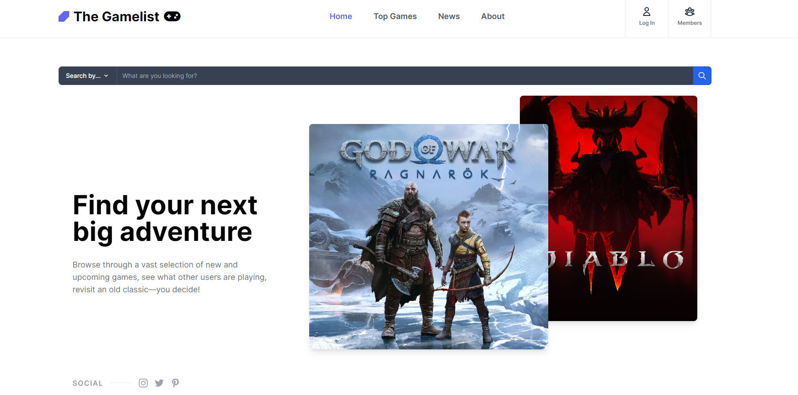
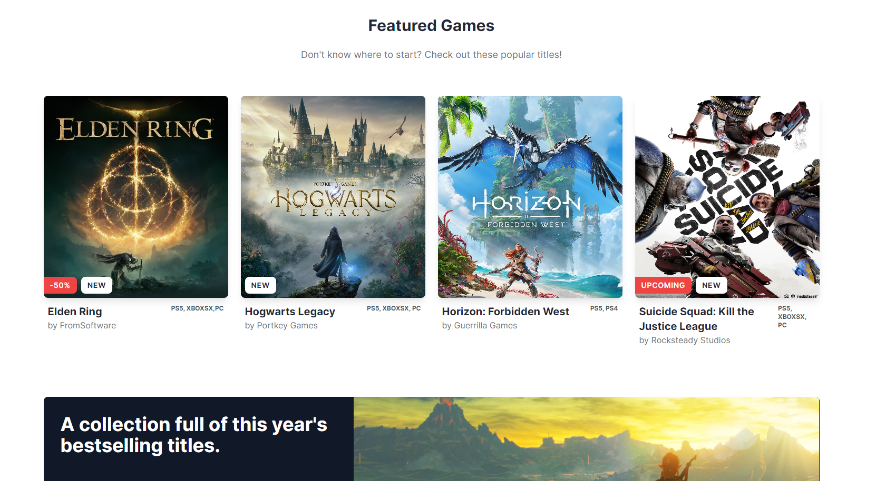
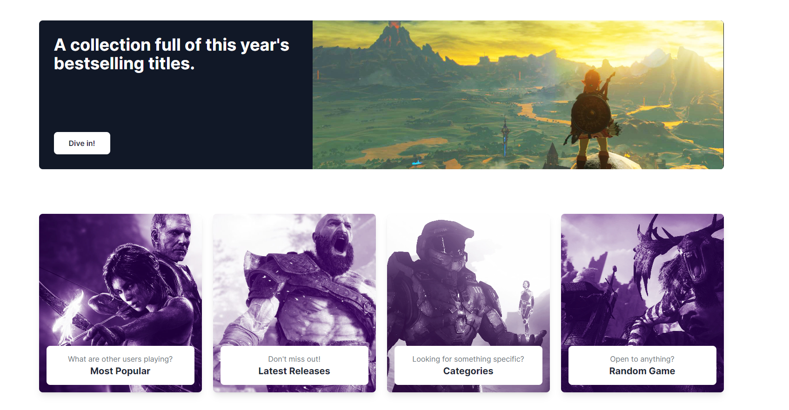

:space_invader: Project GameList :space_invader:
Overview
Project GameList is a full-stack web application that combines a robust back end with a user-friendly front end. The application has been developed as part of the University of Miami's Full Stack Application project and it meets all the project requirements as outlined below.

##
- [Live Link to Heroku APP](https://project-gamelist.herokuapp.com/)

##

Table of Contents
[Description](#description)
[Project Requirements](#project-requirements)
[Presentation Requirements](#presentation-requirements)
[Installation](#installation)
[Developers](#developers)
[License](#license)
[Application Screenshot Preview](#application-screenshot-preview)


## Description

- Project GameList is a full-stack web application that provides a solution to a real-world problem. The application has been developed using agile development methodologies and version control with GitHub. The back end uses Node.js, Express.js, and MySQL with the Sequelize ORM to store data and the front end uses Handlebars.js for the template engine. The application also implements user authentication with express-session and cookies. Sensitive information such as API keys is protected using environment variables. The application has been deployed on Heroku and has a polished user interface that is both responsive and interactive.

## Project Requirements

```md
Use Node.js and Express.js to create a RESTful API.

Use Handlebars.js as the template engine.

Use MySQL and the Sequelize ORM for the database.

Have both GET and POST routes for retrieving and adding new data.

Use at least one new library, package, or technology that we haven’t discussed.

Have a folder structure that meets the MVC paradigm.

Include authentication (express-session and cookies).

Protect API keys and sensitive information with environment variables.

Be deployed using Heroku (with data).

Have a polished UI.

Be responsive.

Be interactive (in other words, accept and respond to user input).

Meet good-quality coding standards (file structure, naming conventions, follows best practices for class/id naming conventions, indentation, quality comments, and so on).

Have a professional README (with unique name, description, technologies used, screenshot, and link to deployed application).
```

## Presentation Requirements

```md
Elevator pitch: A one-minute description of your application.

Concept: What is your user story? What was your motivation for development?

Process: What were the technologies used? How were tasks and roles broken down and assigned? What challenges did you encounter? What were your successes?

Demo: Show your stuff!

Directions for future development.

Links to the deployed application and the GitHub repository. Use the Guide to Deploy with Heroku and MySQL Links to an external site.on The Full-Stack Blog if you need a reminder on how to deploy to Heroku.
```

## Installation

- 1. Clone the repository to your local machine using the following command: 
```md
git clone(https://github.com/MartinCespedes/project-gamelist.git)
```

- 2. Install the required packages by running the following command:
```md 
npm install
```

- 3. Create a database and seed it with data.

##

The packages required to run are:

- bcrypt

- connect-session-sequelize

- dotenv

- express

- express-handlebars

- express-session

- mysql2

- sequelize

A database will need to be created first then seeded wih data.

## Developers

- Sebastian Barrera (BARRERSE) [Link to Github](https://github.com/Barrerse)
- Christopher Cristóbal (cl-czayas) [Link to Github](https://github.com/cl-czayas)
- Alfredo Morales (almoral323) [Link to Github](https://github.com/almoral323)
- Martin Cespedes (MartinCespedes) [Link to Github](https://github.com/MartinCespedes)

## Licenses


Copyright (c) 2023 project-gamelist

This software is copyrighted by the project-gamelist team. All rights reserved.

Permission is hereby granted, free of charge, to any person obtaining a copy of this software and associated documentation files (the "Software"), to deal in the Software without restriction, including without limitation the rights to use, copy, modify, merge, publish, distribute, sublicense, and/or sell copies of the Software, and to permit persons to whom the Software is furnished to do so, subject to the following conditions:

The above copyright notice and this permission notice shall be included in all copies or substantial portions of the Software.

THE SOFTWARE IS PROVIDED "AS IS", WITHOUT WARRANTY OF ANY KIND, EXPRESS OR IMPLIED, INCLUDING BUT NOT LIMITED TO THE WARRANTIES OF MERCHANTABILITY, FITNESS FOR A PARTICULAR PURPOSE AND NONINFRINGEMENT. IN NO EVENT SHALL THE AUTHORS OR COPYRIGHT HOLDERS BE LIABLE FOR ANY CLAIM, DAMAGES OR OTHER LIABILITY, WHETHER IN AN ACTION OF CONTRACT, TORT OR OTHERWISE, ARISING FROM, OUT OF OR IN CONNECTION WITH THE SOFTWARE OR THE USE OR OTHER DEALINGS IN THE SOFTWARE.

## Application Screenshot Preview



##



##


